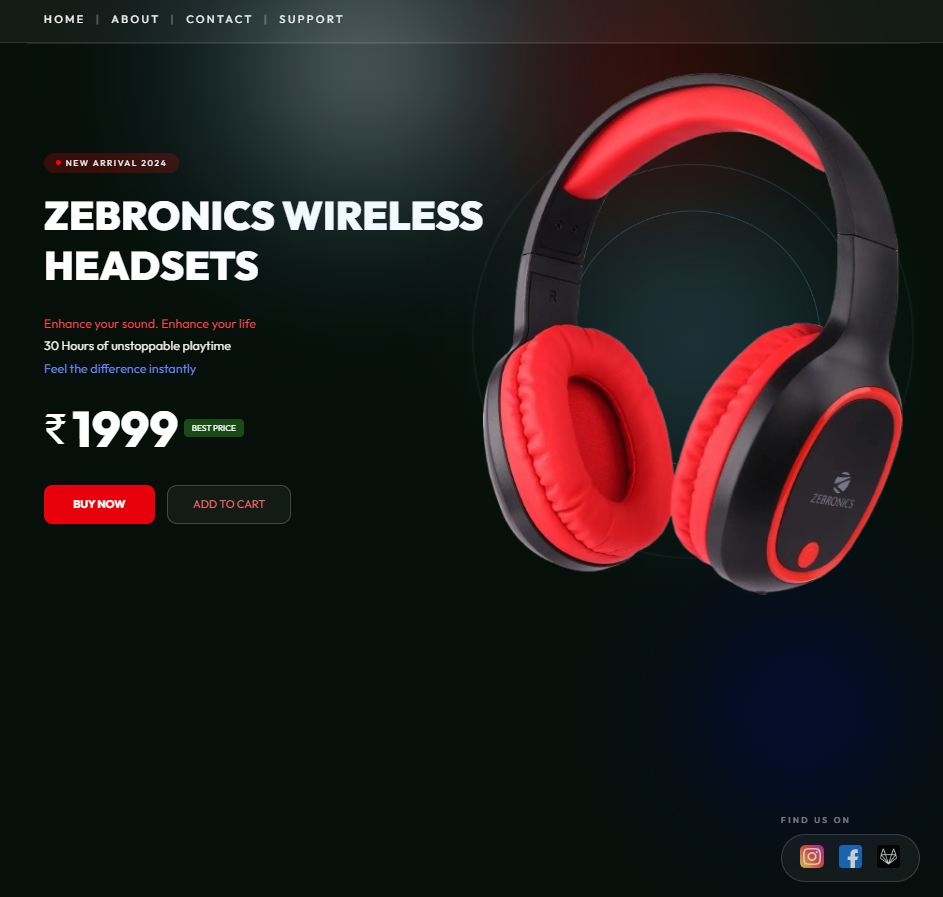

# 🎧 Zebronics Headset Landing Page



A premium **product landing page** for a Zebronics wireless headset featuring modern UI animations and interactive effects.

---
## ✨ Features

* 🌀 3D headset rotation based on mouse movement
* 🔦 Dynamic spotlight lighting effect
* 🎶 Animated soundwave rings around the headset
* 🎧 Floating product animation
* 💎 Glassmorphism navigation UI
* 📱 Fully responsive design for mobile and desktop

---

## 🛠️ Technologies Used

* **HTML5**
* **CSS3**
* **JavaScript**
* **Responsive Web Design**

---

## 📂 Project Structure

```
zebronics-headset-landing-page
│
├── css
│   └── style.css
│
├── js
│   └── script.js
│
├── images
│   └── headset.png
│
├── preview.png
├── index.html
└── README.md
---

## 🚀 How to Run the Project

1. Download or clone the repository

```
git clone https://github.com/badigevamshi/zebronics-headset-landing-page.git
```

2. Open the project folder

3. Run the project by opening:

```
index.html
```

in your browser.

---

## 🌐 Live Demo

If GitHub Pages is enabled, the project will be available at:

```
https://badigevamshi.github.io/zebronics-headset-landing-page
```

---

## 👨‍💻 Author

**Vamshi Badige**

CSE (Data Science) Student
Frontend Developer

GitHub:
https://github.com/badigevamshi

---

## ⭐ Support

If you like this project, consider giving it a **star ⭐ on GitHub**.
